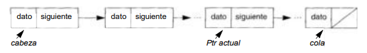

# Estructuras de datos Montículo y Lista Enlazada

> Autor

## Introducción

> Aquí, citando fuentes bibliográficas, define `Estructura de Dato`,
`Tipo de dato` y `tipo de dato abstracto`.

## Montículo binario

> Define los conceptos de *arbol binario* y *montículo binario*. Describe
los montículos binarios de máximo y de mínimo. Explica las operaciones básicas
de inserción de un nuevo dato y remoción del máximo o mínimo. Describe la
implementación de un montículo binario utilizando un arreglo.

## Lista enlazada

Una lista enlazada esta formada por un conjunto de elementos, llamados nodos, los cuales están organizados de forma secuencial, donde cada uno de ellos se conecta al siguiente a través de un puntero. Cada nodo esta formado por dos partes, la primera parte contiene la información y la segunda parte es un puntero al siguiente nodo. 
Para representar una lista enlazada se suele utilizar una caja en cuyo interior se encuentra el dato y a la salida de la caja una flecha que apunta al siguiente elemento. Esta flecha representa al puntero.
El primer nodo de la lista se denomina “cabeza” y esta apuntado por el puntero cabeza. Al último nodo se lo llama “cola”.

Las listas se pueden dividir en cuatro categorías
1-	Lista simplemente enlazada: cada nodo tiene un único puntero que apunta al nodo siguiente
2-	Lista doblemente enlazada: cada nodo tiene dos punteros, uno que apunta al elemento anterior y otro que apunta al elemento siguiente. 
3-	Lista circular simplemente enlazada: es similar a la lista simplemente enlazada, solo que en este caso el último elemento se enlaza con el primer elemento, por lo tanto, la lista se puede recorrer de forma circular.
4-	Lista circular doblemente enlazada: es similar a la lista doblemente enlazada, solo que en este caso el último elemento se enlaza con el primer elemento. Esta lista se puede recorrer de forma circular tanto en el sentido directo como en el inverso.

