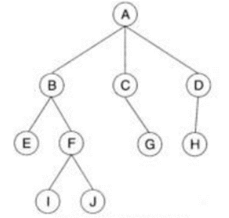
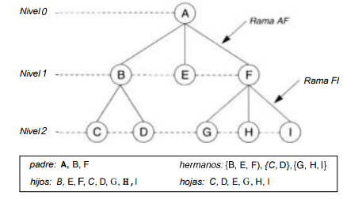
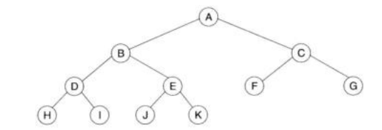
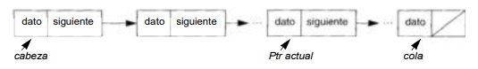

# Estructuras de datos Montículo y Lista Enlazada

> Alumna: Vega Caro, María Ayelén

## Introducción

Los tres tipos de datos básicos de C son los enteros, los numeros reales o numeros de coma flotante, y los caracteres:
-Enteros: pueden ser de tipo `int`, `short`, `long` y `unsigned`.
-Reales: pueden ser del tipo `float`, `double` o `long double`
-Caracteres: son las letras, digitos, simbolos y signos de puntuación. Son del tipo `char` (Aguilar y Martinez, 2002).

Un tipo de dato abstracto (TDA) se puede definir como un modelo matematico en el cual estan definidas determinadas operaciones (Aho et al, 1988).

## Montículo binario

A diferencia de las listas y los arreglos, los árboles son estructuras no lineales. El concepto de árbol es bastante intuitivo y podemos pensarlo como una estructura en la que sus elementos se encuentran relacionados a traves de ramas.
Un arbol esta formado por un conjunto finito de elemntos llamados nodos y por un conjunto finito de lineas, llamadas ramas, que conectan a los notos entre si. Llamamos "grado de un nodo" al numero de ramos asociadas a u nodo en particular.  
El primer nodo del árbol se denomina raiz (si es que el arbol no esta vacío). Por otro lado, decimos que un nodo es padre si tiene nodos sucesores. A estos ultimos los llamamos hijos.
Llamamos "descendientes" a los hijos y nietos de un nodo, y llamamos "ascendientes" a los padres y abuelos de un nodo.Los nodos que comparten el mismo padre se denominan hermanos. Los nodos que no tienen hijos se denominan nodos hojas (Aguilar y Martinez, 2002).

Por otro lado, el nivel de un nodo es la distancia del nodo a la raiz. La raiz se encuentra en el nivel cero, ya que tiene distancia cero con ella misma. La altura del arbol es igual al nivel de la hoja que se encuentra más alejada de la raiz más uno.

Los arboles binarios son aquellos en los que cada nodo puede tener a lo sumo dos hijos. Al nodo de la izquierda se le llama hijo izquierdo y al nodo de la derecha hijo derecho.

Un monticulo binario o arbol binario completo de altura n es una estructura de tipo arbol que tiene como caracteristica principal que para cada nivel desde el 0 hasta "n-1" tienen un conjunto lleno de nodos y todas las hojas ocupan las posiciones más a la izquierda (Aguilar y Martinez, 2002). Dicho de otra manera, todos los nodos desde el nivel 0 hasta el nivel "n-2" tienen dos hijos y las hojas (nodos hijos de los nodos del nivel "n-1") estan ubicadas a la izquierda. Esto se puede observar en la siguiente imagen:

## Lista enlazada

Una lista enlazada esta formada por un conjunto de elementos, llamados nodos, los cuales están organizados de forma secuencial, donde cada uno de ellos se conecta al siguiente a través de un puntero. Cada nodo esta formado por dos partes, la primera parte contiene la información y la segunda parte es un puntero al siguiente nodo. 

Para representar una lista enlazada se suele utilizar una caja en cuyo interior se encuentra el dato y a la salida de la caja una flecha que apunta al siguiente elemento. Esta flecha representa al puntero.
El primer nodo de la lista se denomina “cabeza” y esta apuntado por el puntero cabeza. Al último nodo se lo llama “cola” (Aguilar y Martinez, 2002)

Las listas se pueden dividir en cuatro categorías

1-	Lista simplemente enlazada: cada nodo tiene un único puntero que apunta al nodo siguiente

2-	Lista doblemente enlazada: cada nodo tiene dos punteros, uno que apunta al elemento anterior y otro que apunta al elemento siguiente. 

3-	Lista circular simplemente enlazada: es similar a la lista simplemente enlazada, solo que en este caso el último elemento se enlaza con el primer elemento, por lo tanto, la lista se puede recorrer de forma circular.

4-	Lista circular doblemente enlazada: es similar a la lista doblemente enlazada, solo que en este caso el último elemento se enlaza con el primer elemento. Esta lista se puede recorrer de forma circular tanto en el sentido directo como en el inverso. (Aguilar y Martinez, 2002)

## Referencias
-Alfred V. Aho, John E. Hopcroft, Jefrey De. Ullman (1988). Estructuras de datos y algoritmos.

-Luis Joyanes Aguilar, Ignacio Zahonero Martinez (2002). Programación en C.

